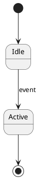
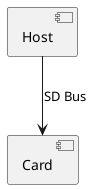

# Figures Directory - Context & Schema Documentation

**Purpose**: Contains extracted and converted figures/diagrams from the SD Host 3.0 specification PDF.

---

## 📁 Directory Structure

```
figures/
├── figures_page_map.json      # Master index of all 83 figures
├── plantuml/                  # PlantUML diagram files
│   ├── FIG_1_1.puml
│   ├── FIG_1_2.puml
│   └── ... (83 figures)
├── images/                    # Original figure images/extractions
└── context.md                 # This file
```

---

## 📋 figures_page_map.json - CRITICAL SCHEMA

This is the **primary index** for all figures in the specification. Use this to:
- Find figures by ID, title, or page number
- Track transcription status
- Access converted PlantUML/diagram files
- Build metadata nodes

### JSON Schema

```json
{
  "_metadata": {
    "source_pdf": "string",              // Source PDF filename
    "total_pages": "integer",            // Total pages in PDF
    "extraction_date": "string",         // YYYY-MM-DD
    "total_figures": "integer",          // Total number of figures
    "page_offset": "integer",            // PDF page offset (spec_page + offset = PDF page)
    "page_offset_note": "string",        // Explanation of offset
    "transcription_progress": {
      "not_started": "integer",          // Count of not yet transcribed
      "in_progress": "integer",          // Count being transcribed
      "completed": "integer",            // Count successfully transcribed
      "skipped": "integer"               // Count intentionally skipped
    }
  },
  "figures": [
    {
      "id": "string",                    // FIG_X_Y format (e.g., "FIG_1_1")
      "spec_reference": "string",        // As appears in spec (e.g., "Figure 1-1")
      "title": "string",                 // Figure title/description
      "spec_page": "integer",            // Page in spec (not PDF)
      "definition_page": "integer",      // Actual PDF page number
      "referenced_on_pages": ["int"],    // All pages referencing this figure
      "reference_count": "integer",      // How many times referenced
      "content": [],                     // Structured content (if extracted)
      "transcription": {
        "status": "string",              // NOT_STARTED | IN_PROGRESS | COMPLETED | SKIPPED
        "text_file": "string",           // Path to PlantUML/diagram file (e.g., "plantuml/FIG_1_1.puml")
        "image_file": "string",          // Path to original image (e.g., "images/FIG_1_1.png")
        "format": "string",              // plantuml | mermaid | ascii | markdown
        "validated": "boolean",          // User validation status
        "validation_notes": "string"     // Any validation comments
      },
      "abstract": "string"               // Brief AI-generated description of figure
    }
  ]
}
```

---

## 🎨 PlantUML Files (figures/plantuml/)

Converted figures in PlantUML format for text-based representation. Each file:
- Named using figure ID: `FIG_X_Y.puml`
- Contains PlantUML syntax for diagrams
- Can be rendered as images or parsed as structured text
- Preserves diagram structure and relationships

### Supported Diagram Types

| Type | PlantUML Syntax | Use Case |
|------|----------------|----------|
| **State Diagram** | `@startuml` / `state` | State machines, FSMs |
| **Sequence Diagram** | `@startuml` / `participant` | Protocol sequences, timing |
| **Component Diagram** | `@startuml` / `component` | Block diagrams, architecture |
| **Activity Diagram** | `@startuml` / `activity` | Flowcharts, procedures |
| **Class Diagram** | `@startuml` / `class` | Register structures, hierarchies |

### Usage

```python
import json

# Load the master index
with open('figures/figures_page_map.json') as f:
    figures_data = json.load(f)

# Find a specific figure
figure = next(f for f in figures_data['figures'] if f['id'] == 'FIG_1_1')

# Check if transcribed
if figure['transcription']['status'] == 'COMPLETED':
    puml_file = f"figures/{figure['transcription']['text_file']}"
    with open(puml_file) as f:
        diagram_text = f.read()
        # Parse or render PlantUML
```

---

## 🎯 Integration with Metadata Pipeline

When building `metadata.json`:

1. **Load figures_page_map.json** to get complete figure inventory
2. **For each figure**:
   - Create a FIGURE node in metadata
   - Link to PlantUML file in `plantuml/` directory
   - Extract figure type from diagram format
   - Include abstract as description

3. **Special figure types**:
   - **BLOCK_DIAGRAM**: System architecture → Create FEATURE nodes
   - **STATE_DIAGRAM**: State machines → Create STATE_MACHINE nodes
   - **TIMING_DIAGRAM**: Timing constraints → Link to PORT nodes
   - **REGISTER_LAYOUT**: Bit fields → Part of REGISTER nodes
   - **FLOWCHART**: Procedures → Create SPEC_CHUNK nodes

4. **Relation creation**:
   - SPEC_CHUNK → FIGURE (when text references "See Figure X-Y")
   - STATE_MACHINE → FIGURE (via VISUALIZED_BY relation)
   - FEATURE → FIGURE (architecture diagrams)
   - REGISTER → FIGURE (bit layout diagrams)

5. **State Machine Extraction**:
   - Parse PlantUML state diagrams
   - Extract states and transitions
   - Create structured STATE_MACHINE nodes
   - Link triggers to registers/events

---

## 🔍 Quick Reference

| Resource | Purpose |
|----------|---------|
| `figures_page_map.json` | Master index - START HERE |
| `plantuml/*.puml` | Text-based diagram representations |
| `images/` | Original extractions (if needed) |
| `_metadata.transcription_progress` | Track transcription status |
| `figure[].transcription.status` | Check if figure is ready to use |
| `figure[].abstract` | AI-generated summary of figure |

---

## ⚠️ Important Notes

1. **Page Numbers**: Use `page_offset` to convert between spec pages and PDF pages
2. **IDs**: Figure IDs use underscore format: `FIG_1_1` (not `FIG_1-1`)
3. **Validation**: Always check `transcription.validated` before using in production
4. **Format Consistency**: All diagrams use PlantUML format for consistency
5. **Abstracts**: The `abstract` field provides quick context without parsing diagrams
6. **State Machines**: CRITICAL for simulation - always validate state machine extractions

---

## 📖 PlantUML Parsing Tips

### State Diagrams

- States: Lines with `[*]` (start/end) or simple names
- Transitions: `-->` with optional triggers after `:`

### Component Diagrams

- Components: `component` keyword
- Connections: `-->` with labels

---

**For metadata extraction agents**: Read this file first to understand the figure resources schema. Use `figures_page_map.json` as the authoritative source for all figure metadata.

**Critical for RAG system**: Figures provide visual context that complements textual specifications. Always link figures to relevant nodes for complete understanding.
