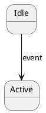

# Metadata Merge Process

> **Purpose**: This document captures key context for building the final `metadata.json` by merging all extracted resources.
> **Status**: IN_PROGRESS
> **Created**: 2026-02-01

---

## 1. Overview

The merge process combines three extracted resources into a unified graph structure:

```
┌─────────────────────────────────────────────────────────────────────┐
│                        INPUT RESOURCES                              │
├─────────────────────────────────────────────────────────────────────┤
│  tables/tables_page_map.json   →  60 tables                        │
│  tables/csv/*.csv              →  Structured table data             │
│  figures/figures_page_map.json →  83 figures                        │
│  figures/plantuml/*.puml       →  Text diagram representations      │
│  spec/sections.json            →  112 sections, 287 chunks          │
└─────────────────────────────────────────────────────────────────────┘
                                 │
                                 ▼
┌─────────────────────────────────────────────────────────────────────┐
│                      MERGE SCRIPT                                   │
│  scripts/merge_metadata.py                                          │
└─────────────────────────────────────────────────────────────────────┘
                                 │
                                 ▼
┌─────────────────────────────────────────────────────────────────────┐
│                        OUTPUT                                       │
│  metadata/metadata.json  →  Unified graph (nodes + relations)       │
└─────────────────────────────────────────────────────────────────────┘
```

---

## 2. Node Types to Generate

| Type | Source | Count (Est) | ID Format |
|------|--------|-------------|-----------|
| `TABLE` | tables_page_map.json | 60 | `TABLE_X_Y` |
| `FIGURE` | figures_page_map.json | 83 | `FIG_X_Y` |
| `SPEC_CHUNK` | sections.json chunks | 287 | `SEC_X_Y_Z_CN` |
| `REGISTER` | Parse from TABLE data | ~45 | `REG_XXX` |
| `FEATURE` | Extract from section 1 | ~20 | `FEAT_XXX` |
| `STATE_MACHINE` | Parse from FIGURE plantuml | ~10 | `SM_XXX` |

**Total nodes estimate: ~500-600**

---

## 3. Relation Types to Generate

| Relation | Description | Detection Method |
|----------|-------------|------------------|
| `REFERENCES` | Chunk references table/figure | Parse "Table X-Y" / "Figure X-Y" in text |
| `CONTAINS` | Section contains chunks | Parent-child from hierarchy |
| `DESCRIBES` | Chunk describes register | Match section title to register name |
| `VISUALIZED_BY` | Register layout shown in figure | Match FIG_2_X to register sections |
| `DEFINED_BY` | Register fields defined in table | Match TABLE_2_X to register sections |
| `SEQUENCE_NEXT` | Programming sequence order | From `programming_sequence_order` field |
| `CHILD_OF` | Section hierarchy | From `hierarchy.parent` field |

---

## 4. Key Mappings

### 4.1 Page Offset
```
pdf_page = spec_page + 11
```

### 4.2 ID Conversions
```python
# Section number to ID
"2.1.3" → "SEC_2_1_3"
"Appendix_A" → "SEC_A"
"A.1" → "SEC_A_1"

# Table reference to ID
"Table 2-17" → "TABLE_2_17"

# Figure reference to ID  
"Figure 1-4" → "FIG_1_4"
```

### 4.3 Section → Register Mapping
Sections titled "XXX Register (Offset YYYh)" map to registers:
- Section `2.2.11` "Power Control Register (Offset 029h)" → `REG_029`
- Section `2.2.14` "Normal Interrupt Status Register (Offset 030h)" → `REG_030`

---

## 5. Merge Algorithm

### Phase 1: Load Sources
```python
tables_map = load_json("tables/tables_page_map.json")
figures_map = load_json("figures/figures_page_map.json")
sections = load_json("spec/sections.json")
```

### Phase 2: Create Base Nodes
1. **TABLE nodes**: From tables_map, include CSV data path
2. **FIGURE nodes**: From figures_map, include plantuml path + abstract
3. **SPEC_CHUNK nodes**: From sections.json chunks

### Phase 3: Extract Derived Nodes
1. **REGISTER nodes**: 
   - Find sections with "Register (Offset XXXh)" in title
   - Parse associated TABLE for fields
   - Link to FIGURE for bit layout
2. **FEATURE nodes**:
   - LLM extraction from Section 1 chunks
   - Deduplicate by name similarity
3. **STATE_MACHINE nodes**:
   - Parse plantuml files with `@startuml` state diagrams
   - Extract states and transitions

### Phase 4: Generate Relations
1. **REFERENCES**: Scan chunk text for "Table X-Y" and "Figure X-Y"
2. **CONTAINS**: From section hierarchy
3. **DESCRIBES**: Match chunk section to register name
4. **VISUALIZED_BY**: Match register to figure by section proximity

### Phase 5: Build Index
1. Generate `index_keywords` for each node
2. Add technical terms (register names, offsets, acronyms)
3. Create cross-reference index

---

## 6. Output Schema: metadata.json

```json
{
  "metadata_version": "1.0.0",
  "spec_info": {
    "name": "SD Host Controller Simplified Specification",
    "version": "3.00",
    "source_file": "sd_host_3_00.pdf",
    "total_pages": 157
  },
  "extraction_info": {
    "extracted_date": "2026-02-01T00:00:00Z",
    "statistics": {
      "total_nodes": 0,
      "by_type": {
        "TABLE": 60,
        "FIGURE": 83,
        "SPEC_CHUNK": 287,
        "REGISTER": 45,
        "FEATURE": 20,
        "STATE_MACHINE": 10
      },
      "total_relations": 0
    }
  },
  "nodes": [
    {
      "id": "TABLE_2_17",
      "type": "TABLE",
      "name": "Power Control Register Fields",
      "table_number": "Table 2-17",
      "csv_file": "tables/csv/TABLE_2_17.csv",
      "source": {"page": 53, "pdf_page": 64},
      "index_keywords": ["power", "control", "register"]
    }
  ],
  "relations": [
    {
      "id": "REL_001",
      "type": "REFERENCES",
      "source_node": "SEC_2_2_11_C0",
      "target_node": "TABLE_2_17"
    }
  ]
}
```

---

## 7. Critical Implementation Notes

### 7.1 Register Extraction Strategy
The spec has ~45 registers. Each register section (2.2.X) follows pattern:
1. Section title contains "Register (Offset XXXh)"
2. Figure shows bit layout (Figure 2-Y)
3. Table lists fields (Table 2-Z)

**Parsing approach**:
- Use section title regex: `(.+?)\s+Register\s*\(Offset\s*([0-9A-Fa-f]+)h\)`
- Find associated table/figure from section's `references`
- Parse table CSV for fields: Location | Attrib | Register Field | Explanation

### 7.2 State Machine Parsing
PlantUML files with state diagrams have pattern:


Parse using regex:
- States: `state\s+"([^"]+)"\s+as\s+(\w+)`
- Transitions: `(\w+)\s*-->\s*(\w+)\s*:\s*(.+)`

### 7.3 Reference Detection
Scan chunk `raw` text for:
- Tables: `Table\s+(\d+)-(\d+)` → `TABLE_$1_$2`
- Figures: `Figure\s+(\d+)-(\d+)` → `FIG_$1_$2`
- Sections: `Section\s+(\d+(?:\.\d+)*)` → `SEC_$1` (replace . with _)

### 7.4 Feature Extraction (LLM)
Section 1 contains feature descriptions. Use LLM to extract:
- Feature name
- Category (DMA, Interrupt, Power, etc.)
- Description
- Is optional flag

---

## 8. Validation Checklist

- [ ] All 60 tables have TABLE nodes
- [ ] All 83 figures have FIGURE nodes  
- [ ] All 287 chunks have SPEC_CHUNK nodes
- [ ] All registers extracted from section 2.2.X
- [ ] All state machine figures parsed
- [ ] Reference relations complete (no dangling)
- [ ] No orphan nodes (nodes without relations)
- [ ] Keyword index generated for all nodes

---

## 9. File Locations Summary

| Resource | Path | Content |
|----------|------|---------|
| Tables map | `tables/tables_page_map.json` | 60 table metadata |
| Table CSVs | `tables/csv/TABLE_X_Y.csv` | Structured data |
| Figures map | `figures/figures_page_map.json` | 83 figure metadata |
| PlantUML | `figures/plantuml/FIG_X_Y.puml` | Diagram text |
| Sections | `spec/sections.json` | 112 sections, 287 chunks |
| Output | `metadata/metadata.json` | Final merged graph |

---

## 10. Session Recovery Notes

If this session ends, to continue:

1. **Current state**: All extraction complete (tables, figures, sections)
2. **Next step**: Create `scripts/merge_metadata.py`
3. **Key files to read**:
   - `docs/process.md` - Full schema definitions (lines 400-700)
   - `tables/tables_page_map.json` - Table structure
   - `figures/figures_page_map.json` - Figure structure  
   - `spec/sections.json` - Section/chunk structure
4. **Implementation order**:
   - Phase 1-2: Basic node creation (TABLE, FIGURE, SPEC_CHUNK)
   - Phase 3: Derived nodes (REGISTER, STATE_MACHINE)
   - Phase 4: Relations
   - Phase 5: Keywords/index
5. **Use haiku model** for any LLM calls (feature extraction)
